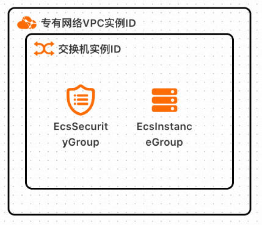
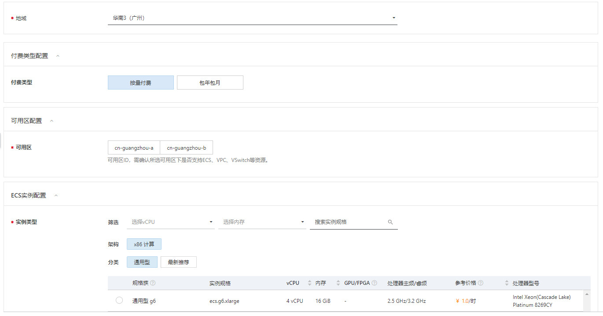
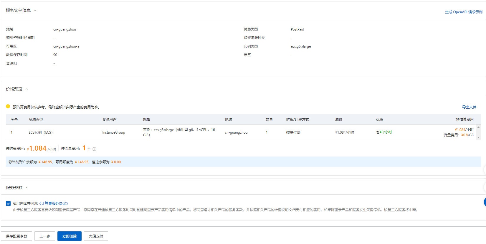
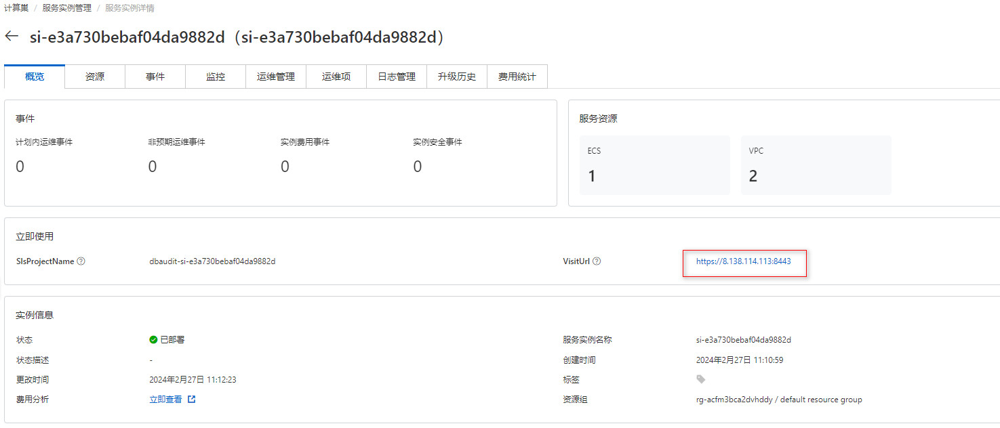

# 绿盟数据库审计服务实例部署文档

## 概述

数据库审计系统是一款通过对数据库网络流量的采集，基于数据库协议解析与还原技术的数据库安全审计系统。本系统实现对数据库所有访问行为的监控和审计、对其中的危险操作进行多种方式的告警、对数据库访问行为进行多维度的统计并进行图形化展现。

## 计费说明

在计算巢上的费用主要涉及：

- 所选vCPU与内存规格
- 系统盘类型及容量
- 公网带宽

计费方式包括：

- 按量付费（小时）
- 包年包月

目前提供如下实例：

| 规格族 | vCPU与内存 | 系统盘 | 公网带宽 |
| --- | --- | --- | --- |
| ecs.g5.xlarge | 	通用型 g5，4vCPU 16GiB | ESSD云盘 200GiB PL1 | 固定带宽1Mbps |
| ecs.g5.2xlarge | 	通用型 g5，8vCPU 32GiB | ESSD云盘 200GiB PL1 | 固定带宽1Mbps |
| ecs.g6.xlarge | 	通用型 g6，4vCPU 16GiB | ESSD云盘 200GiB PL1 | 固定带宽1Mbps |
| ecs.g6.2xlarge | 	通用型 g6，8vCPU 32GiB | ESSD云盘 200GiB PL1 | 固定带宽1Mbps |
| ecs.g6e.xlarge | 	通用平衡增强型 g6e，4vCPU 16GiB | ESSD云盘 200GiB PL1 | 固定带宽1Mbps |
| ecs.g6e.2xlarge | 通用平衡增强型 g6e，8vCPU 32GiB | ESSD云盘 200GiB PL1 | 固定带宽1Mbps |

预估费用在创建实例时可实时看到。
如需更多规格、其他服务（企业级支持服务等），请联系我们，服务热线：400-818-6868

## 部署架构

## RAM账号所需权限

服务需要对ECS、VPC等资源进行访问和创建操作，若您使用RAM用户创建服务实例，需要在创建服务实例前，对使用的RAM用户的账号添加相应资源的权限。添加RAM权限的详细操作，请参见[为RAM用户授权](https://help.aliyun.com/document_detail/121945.html)。所需权限如下表所示。

| 权限策略名称 | 备注 |
| --- | --- |
| AliyunECSFullAccess | 管理云服务器服务（ECS）的权限 |
| AliyunVPCFullAccess | 管理专有网络（VPC）的权限 |
| AliyunROSFullAccess | 管理资源编排服务（ROS）的权限 |
| AliyunComputeNestUserFullAccess | 管理计算巢服务（ComputeNest）的用户侧权限 |
| AliyunLogFullAccess | 管理日志服务（Log）的权限 |

## 部署流程

### 部署步骤

1. 在创建服务实例页面填写配置信息。

2. 配置信息填写完成后，点击下一步确认订单。

3. 确认配置信息是否正确，同意服务条款，最后点击立即创建。

### 部署参数说明

您在创建服务实例的过程中，需要配置服务实例信息。

| 参数组 | 参数项 | 示例 | 说明 |
| --- | --- | --- | --- |
| 地域 |  | 华南3（广州） | 选中服务实例的地域，建议就近选中，以获取更好的网络延时。 |
| 付费类型配置 | 付费类型 | 按量付费 | 根据实际情况填写。 |
| 可用区配置 | 可用区 | cn-guangzhou-a | 根据实际情况填写。 |
| ECS实例配置 | 实例类型 | 通用型 g6 ecs.g6.xlarge | 根据实际情况填写。 |
| SLS日志配置 | 数据保存时间 | 90 | 默认数据保留为90天，可以根据实际情况填写。 |

### 验证结果

1. 查看服务实例。服务实例创建成功后，部署时间大约需要5分钟。部署完成后，页面上可以看到对应的服务实例。 
2. 进入到对应的服务实例后，可以在页面上获取到 web 的访问地址。

### 使用文档

请访问官网了解如何使用：[使用文档](https://www.nsfocus.com.cn/)

## 问题排查

请访问[问题排查链接](https://www.aliyun.com)获取帮助。

## 联系我们

欢迎访问绿盟科技官网（[https://www.nsfocus.com.cn/](https://www.nsfocus.com.cn/)）了解更多信息。

绿盟科技智能客服（[https://user.nsfocus.com/visitor/outSideChat](https://user.nsfocus.com/visitor/outSideChat)）

服务热线：400-818-6868

扫码关注微信公众号，技术博客、活动通知不容错过：

